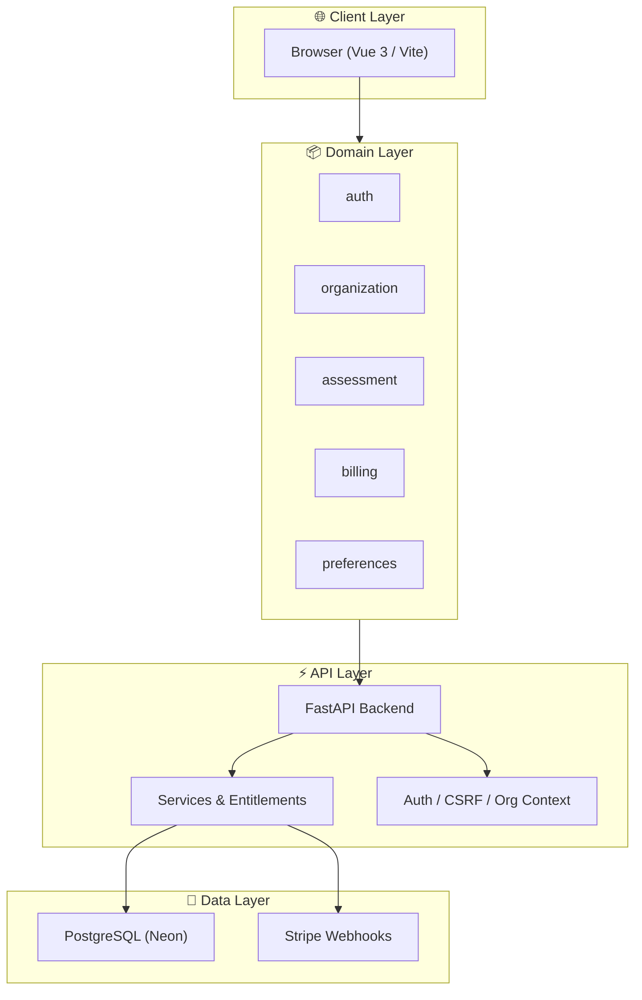

---
audience:
  - ministry
  - church
public_category:
  - technical
status: canonical
tags:
  - Architecture
  - System
  - Canonical
  - public/system
updated: 2025-12-28T16:43
visibility: public
---

# System Overview

Called & Equipped is a multi-tenant, SaaS platform designed to help churches and ministries discern, steward, and develop gifts for faithful service. The system is intentionally architected to balance **theological sensitivity**, **organizational accountability**, and **modern SaaS scalability**.

This document provides a high-level view of how the system is structured, how its parts interact, and the principles guiding its design.

---

## Core Design Principles

The platform is built around the following non-negotiables:

- **Organization-first architecture**  
  All meaningful data exists within the context of an organization.

- **Backend-enforced trust**  
  Permissions, tiers, and entitlements are enforced server-side.

- **Clear separation of concerns**  
  UI, domain logic, infrastructure, and theology are intentionally decoupled.

- **Privacy by default**  
  Individual discernment data belongs to the user, not leadership.

- **Multi-denominational neutrality**  
  The system supports variation without imposing interpretation.

---

## High-Level Architecture

Each layer has a clearly defined responsibility and communicates through stable, documented interfaces.

---

## Frontend Architecture

The frontend is built with **Vue 3 + Vite**, organized using a **domain-driven structure**.

### Key Characteristics
- Domains: `auth`, `organization`, `assessment`, `billing`, `preferences`
- Pinia stores act as **state containers only**
- Business logic lives in domain modules
- Shared API client ensures consistent request handling
- Full internationalization (i18n) support

### Design Goals
- Predictable state
- Minimal coupling between features
- Clear permission-based UI rendering
- Accessibility and church-friendly UX

---

## Backend Architecture

The backend is built with **FastAPI**, following a modular, service-oriented design.

### Key Components
- **Routers**: Thin HTTP layers
- **Services**: Business logic and entitlements
- **Models**: Organization-scoped data models
- **Schemas**: Explicit request/response contracts
- **Dependencies**: Auth, org context, permissions
- **Audit Logging**: Critical write operations

### Security & Enforcement
- Organization context is required for all non-public routes
- Tier limits enforced on every relevant operation
- Demo organizations are strictly read-only
- Super-admin access is explicitly constrained and audited

---

## Multi-Tenancy Model

Multi-tenancy is enforced at the **data and logic layers**, not the UI.

- Users belong to one or more organizations
- Every request resolves an active organization context
- Cross-org access is explicit, not implicit
- Demo organizations are isolated and immutable

This prevents data leakage and accidental cross-org actions.

---

## Authentication & Authorization

Authentication is session-based with strong CSRF protection.

Authorization is determined by:
- User role (member, admin, super-admin)
- Organization context
- Plan tier entitlements
- Feature-level permissions

No authorization decisions are trusted to the frontend.

---

## Billing & Entitlements

Billing is handled via **Stripe**, mapped to organizations rather than individuals.

- Plans determine feature access and limits
- Entitlements are centrally defined
- Stripe webhooks are idempotent and authoritative
- Downgrades preserve data while restricting new actions

Billing state is treated as infrastructure truth, not UI state.

---

## Assessment & Discernment Flow

Assessments are:
- Versioned
- Immutable once completed
- Interpreted using version-pinned logic
- Stored per organization and user

This ensures historical consistency and theological accountability.

---

## Internationalization & Scripture Handling

- Full UI localization across supported languages
- Browser locale detection on first visit
- Manual override always available
- Scripture references dynamically resolved by language
- Predictable fallback logic for unavailable translations

Language is treated as a **preference**, not a setting imposed by leadership.

---

## Deployment & Hosting

- **Frontend**: Netlify (static hosting, edge delivery)
- **Backend**: Render (FastAPI service)
- **Database**: Neon (PostgreSQL)
- **CI/Test Coverage**: Automated unit and E2E testing

Infrastructure choices prioritize reliability, simplicity, and low operational overhead.

---

## What This System Is Not

- Not a diagnostic or psychological tool
- Not a replacement for pastoral discernment
- Not a data-mining or surveillance platform
- Not a one-size-fits-all theological authority

The platform exists to **support**, not replace, human leadership.

---

## Evolution & Stewardship

The system is intentionally designed to evolve slowly, favoring:
- clarity over cleverness
- trust over novelty
- stewardship over growth-at-all-costs

Changes are evaluated not only for technical impact, but for theological, ethical, and pastoral implications.

---

## Related Documents

- [[Frontend Architecture]]
- [[Backend Architecture]]
- [[Auth & Security]]
- [[Stripe & Billing]]
- [[Deployment - Netlify & Render]]
- [[Safeguards & Accountability]]